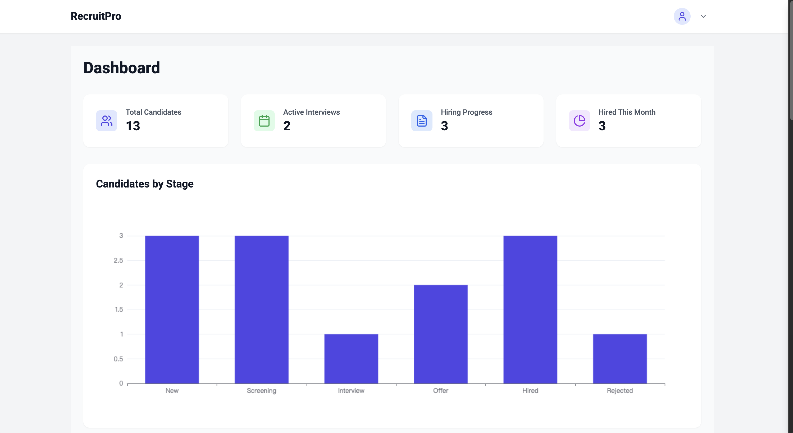
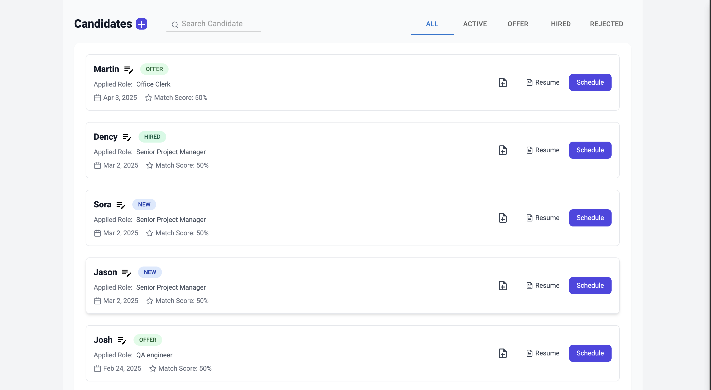
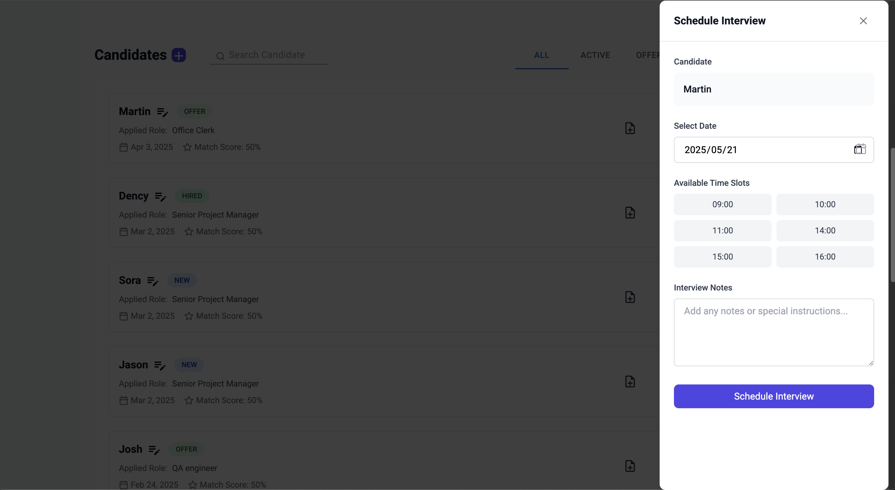

# RecruitPro - Recruitment Management System

  
  
  **A modern recruitment management system designed to help companies efficiently manage their hiring process**
  
  

## 📋 Overview

RecruitPro helps HR teams streamline their recruitment workflow with powerful features:

- **Candidate Management**: Track and organize candidate information
- **Interview Scheduling**: Efficiently arrange and track interviews
- **Recruitment Progress Tracking**: Monitor hiring pipeline at every stage
- **AI Resume Matching**: Leverage AI to match candidates with job requirements

## 🎯 Target Users

- HR Teams
- Recruitment Managers
- Interviewers
- Hiring Managers

## ✨ Feature Modules

- **Dashboard**: Real-time recruitment data overview with visualizations
- **Candidate Management**: Add, view, and schedule candidate interviews
- **Interview Management**: View and manage active interviews
- **Recruitment Progress Tracking**: View candidate distribution by stage
- **Hired Candidates**: View information of hired candidates
- **Interview Scheduling**: Integrated with Google Calendar API for interview scheduling
- **AI Resume Matching**: Calculate job matching degree through **pgvector + OpenAI**
- **Automated Notifications**: Interview reminders (email/SMS notifications)
- **Permission Management**: Role-based access control (Admin/HR/Interviewer)

## 🖼️ Screenshots

  <table>
    <tr>
      <td align="center" width="50%">
         
        <b>Dashboard</b>
      </td>
      <td align="center" width="50%">
         
        <b>Candidate Management</b>
      </td>
    </tr>
    <tr>
      <td align="center" colspan="2">
         
        <b>Interview Schedule</b>
      </td>
    </tr>
  </table>

## 🛠️ Tech Stack

### Frontend
- **Framework**: React
- **Build Tool**: Vite
- **Language**: TypeScript
- **Styling**: Tailwind CSS
- **Data Visualization**: ECharts

### Backend
- **Framework**: NestJS
- **Database**: PostgreSQL
- **BaaS**: Supabase
- **Vector Search**: pgvector

## 🎨 UI Design Guidelines

### Color Scheme
- **Primary**: #007bff (buttons, key information)
- **Background**: #f8f9fa
- **Text**: #343a40
- **Success**: #28a745
- **Error**: #dc3545

### Component Style
- **Componentization**: Tailwind CSS with reusable components
- **UI Elements**: Consistent rounded corners (rounded-lg)
- **Layout**: Responsive design (supports desktop and mobile)

## 🔌 API Design

| Method | Endpoint | Description |
|--------|----------|-------------|
| GET | /api/candidates | Get candidate list |
| POST | /api/candidates | Add candidate |
| GET | /api/candidates/:id | Get candidate details |
| POST | /api/resumes/upload | Upload resume |
| POST | /api/interviews/schedule | Schedule interview |
| POST | /api/match | Calculate matching degree |

## 📁 Project Structure

    recruitpro/
    ├── src/
    │ ├── components/ # Reusable components
    │ ├── types/ # TypeScript type definitions
    │ ├── App.tsx # Main application component
    │ ├── main.tsx # Application entry point
    │ └── index.css # Global styles
    ├── public/ # Static assets
    ├── package.json # Project dependencies and scripts
    ├── vite.config.ts # Vite configuration
    ├── tailwind.config.js # Tailwind CSS configuration
    └── postcss.config.js # PostCSS configuration

## 🤝 Contributing

Contributions are welcome! Please feel free to submit a Pull Request.

## 📝 License

This project is licensed under the MIT License - see the LICENSE file for details.
